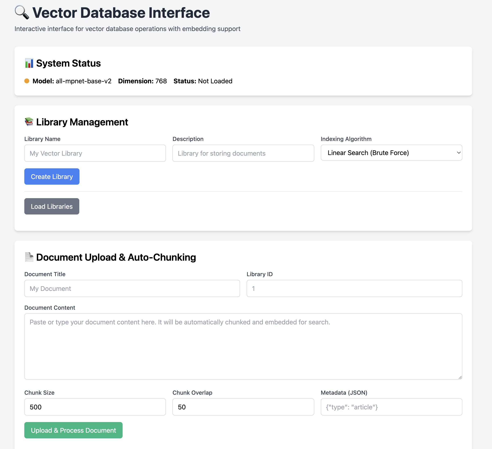
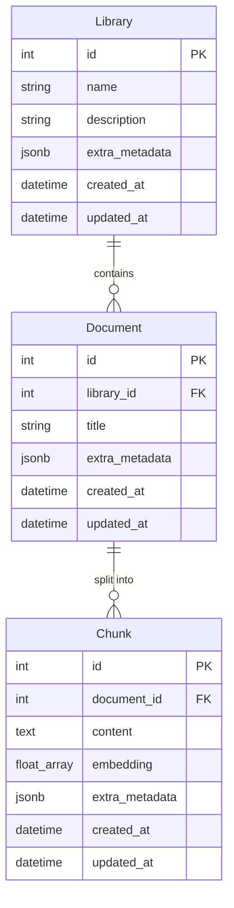

# Vector Database REST API



## Index

- [Summary](#summary)
- [Problem to be Solved](#problem-to-be-solved)
- [A Possible Solution](#a-possible-solution)
- [Business Requirements](#business-requirements)
- [Technical Requirements](#technical-requirements)
- [Implementation](#implementation)
  - [Core Architecture](#core-architecture)
  - [Project Structure and Architecture Overview](#project-structure-and-architecture-overview)
  - [Data Model & Storage](#data-model--storage)
  - [Vector Indexing Algorithms](#vector-indexing-algorithms)
  - [API Design](#api-design)
  - [Technical decisions](#technical-decisions)
  - [How to Run](#how-to-run)
- [Extending](#extending)
  - [Development Patterns](#development-patterns)
  - [API Design Patterns](#api-design-patterns)
  - [Adding New Indexing Methods](#adding-new-indexing-methods)
  - [Adding New Features](#adding-new-features)
- [Testing Strategy](#testing-strategy)
- [License](#license)

## Summary

This is the implementation of a vector database REST API designed to enable semantic search capabilities through text embeddings. The API provides a complete solution for storing, indexing, and querying text documents using vector embeddings, built with FastAPI, PostgreSQL, and Sentence Transformers. It supports multiple indexing algorithms, metadata filtering, and concurrent operations while maintaining data consistency.

### Problem to be Solved

When storing text simply as VARCHAR, can search things by matching specific words, - think if you want to read something about Artificial Intelligence and you just search for "AI". The best thing we can do initially is looking for all parts of the text that have this keyword as a substring.

This approach has significant limitations. What if someone wrote about "machine learning" but never used the term "AI"? Traditional keyword search would miss this highly relevant content. Similarly, searching for "car problems" wouldn't find documents about "automotive issues" even though they discuss the same topic.

### A Possible Solution

To improve this, we may use `word embeddings` - we turn text into numeric vectors which have an actual meaning in relationship to other vectors associated with them. But how can we actually turn words into collection of numbers and attribute meaning to it? One way is iterating over a _corpus_ of text with the hypothesis that neighboring words in a text have semantic similarities with each other (even though the word `cat` looks more like `car` structurally, it appears more often in the same contexts as the word `dog`, so we assume that `cat` is semantically more similar to `dog` than `car`).

To actually get the vector representations, we use transformer models that have been trained on massive amounts of text to understand semantic relationships. These models convert text into high-dimensional vectors where semantically similar concepts cluster together in vector space. When we compute the cosine similarity (which is the cosine of the angle between vectors) between these vectors, we get a measure of semantic relatedness that is a lot better than simple index matching (assuming our hypothesis is at least somewhat correct).

In this repository we'll implement an API (`FastAPI`) that allows users to create libraries that have documents (made of chunks). The API optionally creates embeddings (using `Sentence Transformers`) of these documents, and stores emeddings and original text in a database (`Postgres`).

We want fast retrieval, so we'll also manually implement indexing (different ways of structuring the data) algorithms with different tradeoffs to improve this.

### Business Requirements

The core business requirements for the API are:

1. We need to have libraries (which have associated metadata) that organize documents, which are made of chunks and metadata
2. Chunks are pieces of text with associated embeddings and metadata
3. Users should be able to create, read, update, and delete libraries, documents, and chunks within a library
4. It should be possible to index the contents of a library
5. User should be able to perform K-Nearest Neighbor vector search over the selected library with a given embeddin query

### Technical Requirements

And some of the technical requirements:

1. We need to have at least two indexing algorithms implemented
2. We need to ensure no data races between reads and writes
3. We need an API layer on top of the logic to let a client interact
4. The project should be dockerized
5. We need metadata filtering to enhance query results
6. The database state should be persisted to disk
7. We should have a simple proof of concept interface that demonstrates the main API functionalities

## Implementation

### Core Architecture

The implementation follows a clean architecture pattern with clear separation between data persistence, business logic, and external interfaces. The hierarchical data model enables semantic search at different granularities while maintaining referential integrity.



### Project Structure and Architecture Overview

The codebase is organized around a layered architecture inspired by Domain-Driven Design principles. The implementation strikes a balance between abstraction and functionality - adopting key DDD concepts like domain separation, service layers, and repository patterns without the complexity of pure DDD patterns that would be overkill for this scope.

```
backend/src/
├── infrastructure/                 # Cross-cutting concerns
│   ├── app_factory.py             # FastAPI app configuration
│   ├── config/
│   │   └── settings.py            # Environment-based configuration
│   ├── database/
│   │   ├── models.py              # SQLAlchemy base models & mixins
│   │   └── session.py             # Async session management
│   ├── indexing/
│   │   ├── base.py                # VectorIndex abstract interface
│   │   ├── linear_search.py       # O(n*d) brute-force algorithm
│   │   ├── ivf.py                 # O(k*d) clustering algorithm
│   │   └── manager.py             # Index lifecycle management
│   └── logging/
│       ├── config.py              # Environment-aware logging setup
│       └── handlers.py            # Custom log formatters
├── interfaces/                     # External interfaces
│   ├── api/v1/                    # REST API endpoints
│   │   ├── library.py             # Library CRUD + search
│   │   ├── document.py            # Document CRUD operations
│   │   ├── chunk.py               # Chunk CRUD operations
│   │   └── embedding.py           # Embedding services
│   ├── ui/
│   │   └── router.py              # HTMX web interface
│   └── main.py                    # Application entry point
└── modules/                        # Business domain logic
    ├── library/
    │   ├── models.py              # Library SQLAlchemy model
    │   ├── schemas.py             # Pydantic request/response schemas
    │   ├── crud.py                # Database operations
    │   └── services.py            # Business logic & orchestration
    ├── document/                   # Document domain (same structure)
    ├── chunk/                      # Chunk domain (same structure)
    ├── embedding/
    │   ├── providers.py           # Embedding model abstractions
    │   └── services.py            # Document processing & auto-chunking
    └── common/
        └── utils/                 # Shared utilities
```

**Architecture Layers**:

1. **Infrastructure Layer**: Handles cross-cutting concerns like database connectivity, logging, configuration management, and vector indexing algorithms. These components are shared across the entire application.

2. **Domain Layer**: Contains business entities (Library, Document, Chunk) with their associated business rules and operations. Each domain follows a consistent structure with models, schemas, CRUD operations, and services.

3. **Interface Layer**: Exposes functionality through REST APIs and web interfaces. Both interface types delegate to the same service layer, ensuring consistent behavior across different access methods.

**Key Design Patterns**:

- **Dependency Injection**: Services receive dependencies through constructors, enabling easy testing and loose coupling
- **Repository Pattern**: FastCRUD abstracts database operations, allowing business logic to remain database-agnostic
- **Service Layer**: Encapsulates complex business operations and coordinates between multiple entities
- **Factory Pattern**: App factory creates configured FastAPI instances for different environments

### Data Model & Storage

**Hierarchical Organization**: Libraries -> Documents -> Chunks

```python
# Example chunk with embedding
class Chunk(Base):
    content: str                    # Original text
    embedding: List[float]          # 768-dimensional vector
    extra_metadata: dict           # Flexible JSON metadata
    document_id: int               # Parent document reference
```

**PostgreSQL Schema**: Uses native `ARRAY(Float)` for vector storage with JSONB metadata for schema flexibility.

### Vector Indexing Algorithms

#### 1. Linear Search Algorithm

The first one we implemented is a simple linear search (brute-force), this is the baseline - it should provide accuracy at a big cost in time and space.

```python
class LinearSearchIndex(VectorIndex):
    async def search(self, query_embedding: List[float], k: int) -> List[SearchResult]:
        # Brute-force cosine similarity comparison
        similarities = [
            self._cosine_similarity(query_embedding, vector.embedding)
            for vector in self._vectors.values()
        ]
        # Return top-k results
```

**Characteristics**:

- **Time**: O(n*d) - compares against every vector
- **Space**: O(n*d) - stores all vectors in memory
- **Accuracy**: 100% exact results
- **Use Case**: Small datasets (<10k vectors), exact results required

#### 2. IVF (Inverted File Index) Algorithm

The second one is inverted file, it uses k means to split vectors into different clusters, then searches only in the relevant clusters. It should provide faster read results at the cost of accuracy (doesn't search the whole thing), and write time. This is our second option because it's not complex, but it's a lot better than linear (80% of reward for 20% of effort).

```python
class IVFIndex(VectorIndex):
    def __init__(self, dimension: int, num_clusters: int = 100, num_probes: int = 1):
        self.num_clusters = num_clusters
        self.num_probes = num_probes

    async def build_index(self):
        # Partition vectors using k-means clustering
        centroids, assignments = self._kmeans(embeddings, self.num_clusters)

    async def search(self, query_embedding: List[float], k: int) -> List[SearchResult]:
        # Search only the nearest clusters
        cluster_indices = self._find_nearest_clusters(query_vec, self.num_probes)
        # Only search vectors in selected clusters
```

**Characteristics**:
- **Time**: O(k*d) where k << n (searches subset of vectors)
- **Space**: O(n*d + c*d) where c is cluster count
- **Accuracy**: good with proper tuning (chunk size, etc)
- **Use Case**: Large datasets requiring fast approximate search

### API Design

The REST API provides CRUD operations across all entities with intuitive resource hierarchies. I used FastCRUD for database operations.

| Method | Endpoint | Description |
|--------|----------|-------------|
| **Libraries** |  |  |
| GET | `/api/v1/libraries` | List all libraries with pagination |
| POST | `/api/v1/libraries` | Create new library |
| GET | `/api/v1/libraries/{id}` | Get library details with stats |
| PUT | `/api/v1/libraries/{id}` | Update library metadata |
| DELETE | `/api/v1/libraries/{id}` | Delete library and all contents |
| GET | `/api/v1/libraries/{id}/documents` | List documents in library |
| **Documents** |  |  |
| POST | `/api/v1/documents` | Create document manually |
| GET | `/api/v1/documents/{id}` | Get document with chunk count |
| PUT | `/api/v1/documents/{id}` | Update document metadata |
| DELETE | `/api/v1/documents/{id}` | Delete document and chunks |
| POST | `/api/v1/documents/auto-chunk` | Upload with auto-chunking |
| **Chunks** |  |  |
| POST | `/api/v1/chunks` | Create chunk with embedding |
| GET | `/api/v1/chunks` | List chunks with pagination |
| GET | `/api/v1/chunks/{id}` | Get specific chunk |
| PUT | `/api/v1/chunks/{id}` | Update chunk content/metadata |
| DELETE | `/api/v1/chunks/{id}` | Delete chunk |
| **Search** |  |  |
| POST | `/api/v1/libraries/{id}/search/text` | Text query → embedding → search |
| POST | `/api/v1/libraries/{id}/search/vector` | Direct vector search |
| **Embeddings** |  |  |
| GET | `/api/v1/embedding/info` | Model information and stats |
| POST | `/api/v1/embedding/embed-text` | Convert text to embedding |
| POST | `/api/v1/embedding/embed-documents` | Batch document embedding |

### Technical decisions

Here are the explanations behind some of the technical decisions:

- We're using Sentence Transformers to be able to just clone and immediately test the implementation locally with no need for external api keys.
- The system handles concurrent operations through a multi-layered approach that prevents race conditions while maintaining high performance. Each library has its own async lock to ensure index modifications are atomic, while database transactions provide ACID guarantees. In a production setting I would probably use Copy on Read, but this is enough for this proof of concept.
- Document processing happens asynchronously to prevent blocking the user interface. When users upload documents, they receive immediate feedback while chunking, embedding, and indexing happen in the background with real-time status updates.
- We used HTMX for the UI since it's simple and functional.

### How to Run

The entire system runs with a single Docker Compose command that orchestrates both the FastAPI application and PostgreSQL database. The setup includes health checks to ensure the database is ready before the application starts.

**Prerequisites**:
- Docker and Docker Compose
- Git (to clone the repository)

**Quick Start**:
```bash
# Clone the repository
git clone https://github.com/igorbenav/vector-db-project
cd vector-db-project

# Start the entire stack
docker compose up --build
```

**What Gets Created**:

When you run `docker compose up --build`, the system creates:

1. **PostgreSQL Database Container** (`db` service):
    - Uses PostgreSQL 13 with persistent volume storage
    - Creates `vectordb` database with user `postgres`
    - Runs health checks to ensure readiness
    - Exposes port 5432 internally

2. **FastAPI Application Container** (`web` service):
    - Builds from the included Dockerfile
    - Installs Python dependencies with uv
    - Runs with uvicorn on port 8000 with hot reload
    - Waits for database health check before starting

3. **Database Schema**:
    - Automatically creates tables on startup (`CREATE_TABLES_ON_STARTUP=true`)
    - Sets up the Library -> Document -> Chunk hierarchy
    - Configures proper foreign key relationships and indexes

**Environment Configuration**:

The `.env` file contains all necessary configuration:
```bash
# Database connection (matches docker-compose services)
POSTGRES_USER=postgres
POSTGRES_PASSWORD=postgres
POSTGRES_SERVER=db
POSTGRES_DB=vectordb

# Application settings
ENVIRONMENT=development
DEBUG=true
CREATE_TABLES_ON_STARTUP=true

# CORS settings for web interface
CORS_ENABLED=true
CORS_ORIGINS=*
```

**Access Points**:

- **Interactive Web UI**: http://localhost:8000
- **API Documentation**: http://localhost:8000/docs
- **REST API Base**: http://localhost:8000/api/v1

**Development Mode**:

For local development without Docker:
```bash
# Install dependencies
uv sync

# Start PostgreSQL manually or use existing instance
# Update .env with your database connection details

# Run the application
uv run python backend/src/interfaces/main.py

# Run tests
uv run python -m pytest
```

## Extending

This section covers how to extend the vector database with new functionality while maintaining code quality and consistency.

### Development Patterns

The codebase follows consistent development workflows that ensure code quality through automated tooling and CI/CD pipelines.

**Local Development Setup**:
```bash
# Install all dependencies including dev tools
uv sync --all-extras

# Format code automatically
uv run ruff format

# Check code quality and style
uv run ruff check

# Type checking with mypy
uv run mypy backend/src --config-file pyproject.toml

# Run test suite
uv run python -m pytest
```

**Automated Quality Checks**:

The project includes GitHub Actions workflows that run on every push and pull request:

- **Linting** (`.github/workflows/linting.yml`): Runs `ruff check` to enforce code style and catch common issues
- **Type Checking** (`.github/workflows/type-checking.yml`): Uses `mypy` with strict configuration to ensure type safety
- **Testing** (`.github/workflows/tests.yml`): Executes the full test suite including integration tests

These workflows ensure that all code contributions meet quality standards before merging. The same commands used in CI can be run locally to catch issues early in the development process.

### API Design Patterns

API endpoints follow consistent patterns that make the system predictable and easy to extend. When adding new endpoints, follow these established conventions:

**Resource Hierarchy**: URLs reflect the domain relationships (`/libraries/{id}/documents/{id}/chunks`). This makes the API intuitive and follows REST principles naturally.

**Standard HTTP Methods**: Use appropriate HTTP verbs (GET for retrieval, POST for creation, PUT for updates, DELETE for removal) with corresponding status codes (200, 201, 404, 422).

**Pydantic Schemas**: All request and response data uses Pydantic models for validation and serialization. Create separate schemas for Create, Update, and Read operations to maintain clear boundaries.

**Dependency Injection**: Use FastAPI's dependency system for database sessions, services, and authentication. This keeps endpoints focused on HTTP concerns while delegating business logic to services.

**Error Handling**: Return structured error responses with appropriate HTTP status codes. Include validation details for 422 responses and clear error messages for all failure cases.

### Adding New Indexing Methods

The vector indexing system is designed to be extensible. To add a new indexing algorithm:

**1. Implement the VectorIndex Interface**:
```python
# backend/src/infrastructure/indexing/my_algorithm.py
class MyIndex(VectorIndex):
    def __init__(self, dimension: int, **params):
        super().__init__(dimension)
        # Algorithm-specific parameters

    async def add_vector(self, vector: ChunkVector) -> None:
        # Add vector to index

    async def search(self, query_embedding: List[float], k: int,
                    metadata_filter: Optional[Dict] = None) -> List[SearchResult]:
        # Perform search with your algorithm

    async def build_index(self) -> None:
        # Build/optimize index structure
```

**2. Register in IndexType Enum**:
```python
# backend/src/infrastructure/indexing/types.py
class IndexType(str, Enum):
    LINEAR_SEARCH = "linear_search"
    IVF = "ivf"
    MY_ALGORITHM = "my_algorithm"  # Add your algorithm
```

**3. Update IndexManager**:
```python
# backend/src/infrastructure/indexing/manager.py
elif index_type == IndexType.MY_ALGORITHM:
    self._indexes[library_id] = MyIndex(dimension=embedding_dimension, **params)
```

The pluggable design ensures that new algorithms integrate seamlessly with existing functionality, including the web interface, API endpoints, and persistence layer.

### Adding New Features

To add new domain entities or business functionality, follow the established module pattern:

**1. Create Domain Module**:
```
backend/src/modules/my_feature/
├── models.py       # SQLAlchemy database models
├── schemas.py      # Pydantic request/response models
├── crud.py         # Database operations with FastCRUD
└── services.py     # Business logic and orchestration
```

**2. Define Database Model**:
```python
# models.py
class MyEntity(Base, TimestampMixin):
    __tablename__ = "my_entities"

    id: Mapped[int] = mapped_column(Integer, primary_key=True)
    name: Mapped[str] = mapped_column(String, nullable=False)
    # Add relationships to existing entities if needed
```

**3. Create Pydantic Schemas**:
```python
# schemas.py
class MyEntityCreate(BaseModel):
    name: str

class MyEntityRead(BaseModel):
    id: int
    name: str
    created_at: datetime
```

**4. Implement Service Logic**:
```python
# services.py
class MyEntityService:
    def __init__(self):
        # Inject dependencies

    async def create_entity(self, data: MyEntityCreate, db: AsyncSession) -> MyEntityRead:
        # Business logic here
```

**5. Add API Endpoints**:
```python
# backend/src/interfaces/api/v1/my_feature.py
@router.post("/my-entities", response_model=MyEntityRead)
async def create_entity(data: MyEntityCreate, db: AsyncSession = Depends(async_session)):
    service = MyEntityService()
    return await service.create_entity(data, db)
```

This pattern ensures consistency across the codebase and makes new features feel native to the existing system.

## Testing Strategy

The testing approach combines multiple testing levels to ensure reliability while maintaining fast feedback cycles during development.

**Test Categories**:

**Unit Tests**: Focus on individual service methods and business logic with mocked dependencies. These tests run quickly and verify that business rules are correctly implemented.

```python
# Example: Testing embedding service with mocked dependencies
@pytest.mark.asyncio
async def test_create_document_with_auto_chunks(service, mock_db):
    with patch.object(service.embedding_service, "embed_texts") as mock_embed:
        mock_embed.return_value = [[0.1, 0.2, 0.3], [0.4, 0.5, 0.6]]

        result = await service.create_document_with_auto_chunks(doc_data, mock_db)

        assert result.title == "Test Document"
        mock_embed.assert_called_once()
```

**Integration Tests**: Test complete workflows using real database instances via testcontainers. These verify that the entire system works together correctly.

```python
# Example: End-to-end API testing with real database
@pytest.mark.asyncio
async def test_document_upload_and_search_integration(client, db_session):
    # Create library
    library_response = await client.post("/api/v1/libraries", json={"name": "Test"})
    library_id = library_response.json()["id"]

    # Upload document with auto-chunking
    doc_response = await client.post("/api/v1/documents/auto-chunk", json={
        "title": "AI Guide", "content": "Artificial intelligence...", "library_id": library_id
    })

    # Search and verify results
    search_response = await client.post(f"/api/v1/libraries/{library_id}/search/text", json={
        "query_text": "artificial intelligence", "k": 5
    })
    assert len(search_response.json()["results"]) > 0
```

**Test Infrastructure**:

The test suite uses several tools to ensure reliable testing:

- **pytest-asyncio**: Handles async test execution properly
- **testcontainers**: Provides isolated PostgreSQL instances for integration tests
- **AsyncMock**: Mocks async dependencies in unit tests
- **Fixtures**: Provide consistent test data across test suites

**Running Tests**:

```bash
# Run all tests
uv run python -m pytest

# Run specific test categories
uv run python -m pytest backend/tests/test_units/        # Unit tests only
uv run python -m pytest backend/tests/test_integration/ # Integration tests only

# Run specific test file
uv run python -m pytest backend/tests/test_embedding/test_enhanced_services.py
```

**Test Organization**: Tests mirror the source code structure with separate directories for unit and integration tests. Each domain module has corresponding test files that verify both happy paths and error conditions.

## License

This project is licensed under the MIT License - see the [LICENSE.md](LICENSE.md) file for details.
